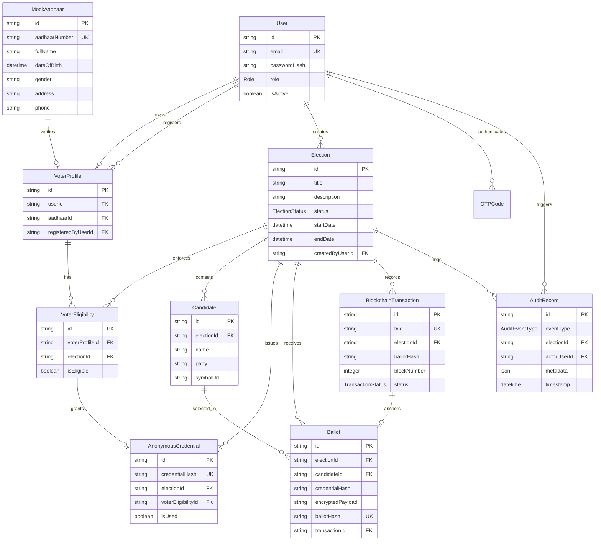

# VoteChain Entity-Relationship (ER) Diagram

The following Mermaid diagram visualizes the relational schema, foreign key constraints, and model relationships across VoteChain database entities:

```mermaid
erDiagram
    MockAadhaar ||--o| VoterProfile : "verifies"
    User ||--o| VoterProfile : "owns"
    User ||--o{ VoterProfile : "registers"
    User ||--o{ Election : "creates"
    User ||--o{ OTPCode : "authenticates"
    User ||--o{ AuditRecord : "triggers"

    VoterProfile ||--o{ VoterEligibility : "has"
    Election ||--o{ VoterEligibility : "enforces"
    Election ||--o{ Candidate : "contests"
    Election ||--o{ AnonymousCredential : "issues"
    Election ||--o{ Ballot : "receives"
    Election ||--o{ BlockchainTransaction : "records"
    Election ||--o{ AuditRecord : "logs"

    VoterEligibility ||--o| AnonymousCredential : "grants"
    Candidate ||--o{ Ballot : "selected_in"
    BlockchainTransaction ||--o| Ballot : "anchors"

    MockAadhaar {
        string id PK
        string aadhaarNumber UK
        string fullName
        datetime dateOfBirth
        string gender
        string address
        string phone
    }

    User {
        string id PK
        string email UK
        string passwordHash
        Role role
        boolean isActive
    }

    VoterProfile {
        string id PK
        string userId FK
        string aadhaarId FK
        string registeredByUserId FK
    }

    Election {
        string id PK
        string title
        string description
        ElectionStatus status
        datetime startDate
        datetime endDate
        string createdByUserId FK
    }

    Candidate {
        string id PK
        string electionId FK
        string name
        string party
        string symbolUrl
    }

    VoterEligibility {
        string id PK
        string voterProfileId FK
        string electionId FK
        boolean isEligible
    }

    AnonymousCredential {
        string id PK
        string credentialHash UK
        string electionId FK
        string voterEligibilityId FK
        boolean isUsed
    }

    Ballot {
        string id PK
        string electionId FK
        string candidateId FK
        string credentialHash
        string encryptedPayload
        string ballotHash UK
        string transactionId FK
    }

    BlockchainTransaction {
        string id PK
        string txId UK
        string electionId FK
        string ballotHash
        integer blockNumber
        TransactionStatus status
    }

    AuditRecord {
        string id PK
        AuditEventType eventType
        string electionId FK
        string actorUserId FK
        json metadata
        datetime timestamp
    }
```
